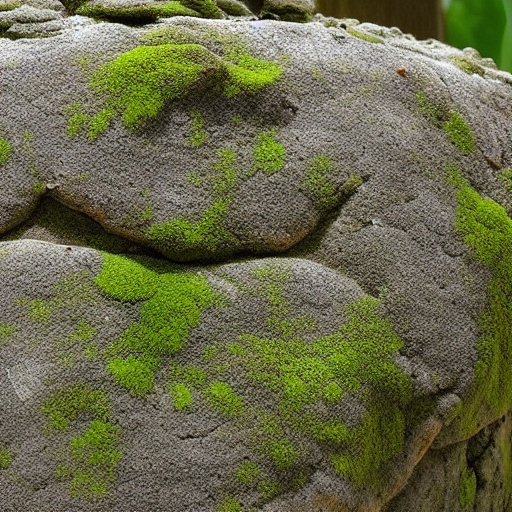

# Stable-Diffusion-Burn with ROCM backend

## Running

# rocm (60 seconds)

```
cargo run --release --features rocm-backend --bin sample burn SDv1-4 7.5 20 "An ancient mossy stone." img
```

This command will generate an image according to the provided prompt, which will be saved as 'img0.png'.



## Get burn with latest/installed version of rocm

### Get development version from github

```
git clone https://github.com/tracel-ai/burn
git clone https://github.com/tracel-ai/cubecl/
git clone https://github.com/tracel-ai/cubecl-hip-sys/
git clone https://github.com/tracel-ai/cubek
```

#### Run the exampele

```
cd cubecl
cargo run --example gelu --features hip
```

Error message when ***no HIP_SUCCESS in the root*** this means the hip version is not yet supported by the cubecl_hip_sys crate, it is linking to the wrong hip/rocm version that is installed on the system.

### Build cubecl with latest cubecl-hip-sys

change the cubecl/crates/cubecl-hip/Cargo.toml
```
cubecl-hip-sys = { version = "7.0.5183101" }  to the correct version. ->
cubecl-hip-sys = { path = "../../../cubecl-hip-sys/crates/cubecl-hip-sys", version = "7.1.52802" }
```

```
git clone https://github.com/tracel-ai/cubecl-hip-sys/
cd cubecl-hip-sys
```
Read the readme! And create a version


### Fix cubecl and example

```
cd cubecl
examples/gelu/Cargo.toml
hip = ["cubecl/hip"]
```

examples/gelu/examples/gelu.rs
```
#[cfg(feature = "hip")]    
gelu::launch::<cubecl::hip::HipRuntime>(&Default::default());
```
examples/gelu/Cargo.toml
```
hip = ["cubecl/hip"]
```

#### Supported for graphics card (gfx1201)

```
thread 'main' (40614) panicked at crates/cubecl-hip/src/runtime.rs:90:9:
assertion `left == right` failed
````

#### Add arch to amdarchitecture

cubecl-cpp/src/hip/arch.rs
add GFX gfx12, same as gfx11

crates/cubecl-cpp/src/hip/mma/rocwmma_compiler.rs add Architecture::GFX12

### Switch to dev version

comment out the lines ### For local development. ###
* burn/Cargo.toml
* cubek/Cargo.toml


